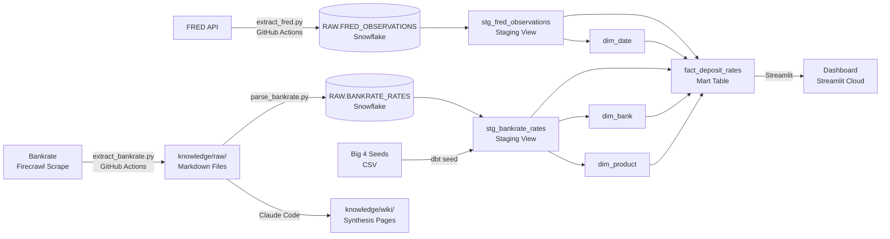
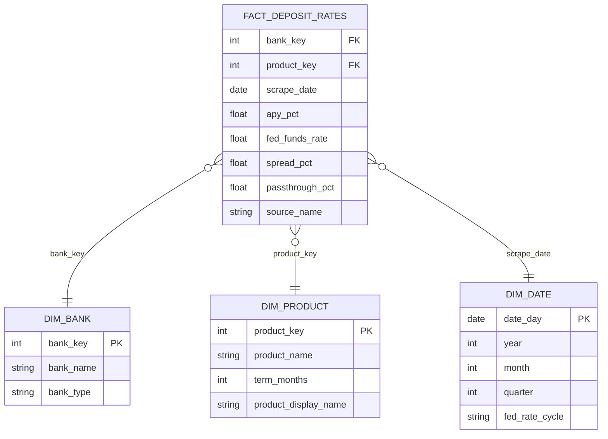

# Deposit Pricing Analytics

> **Tracking how major U.S. banks respond to Federal Reserve rate changes — and which banks pass the most value to savers.**

**Live Dashboard:** [STREAMLIT_DASHBOARD_URL]

---

## Business Question

When the Fed raises or lowers interest rates, how do major banks respond with their deposit pricing? Which banks pass through rate changes fastest, and who is winning deposits?

**Why it matters:** During the 2022–2023 rate hiking cycle, the Fed raised rates from ~0% to 5.25% — the fastest increase in 40 years. Online banks (Marcus, Ally, SoFi) tracked the Fed closely, raising savings APYs by 4–5%. Big traditional banks (Chase, BofA, Wells Fargo) barely moved. A $100,000 deposit at a top online bank earned ~$4,000–$5,000 more per year than the same deposit at a big bank.

---

## Tech Stack

| Layer | Tool |
|-------|------|
| IDE | Cursor + Claude Code |
| Data Warehouse | Snowflake |
| Transformation | dbt |
| Orchestration | GitHub Actions (weekly schedule) |
| Dashboard | Streamlit (Community Cloud) |
| Knowledge Base | Claude Code + Firecrawl |
| Version Control | Git + GitHub |

---

## Data Sources

| Source | Type | Destination |
|--------|------|-------------|
| [FRED API](https://fred.stlouisfed.org/) | REST API | `DEPOSIT_ANALYTICS.RAW.FRED_OBSERVATIONS` |
| [Bankrate](https://www.bankrate.com/) | Firecrawl scrape | `knowledge/raw/` → `DEPOSIT_ANALYTICS.RAW.BANKRATE_RATES` |
| Big Four seeds | CSV | `dbt/seeds/big_four_rates.csv` |

FRED series loaded: Fed Funds Rate (monthly + daily), 3-Month/1-Year/2-Year/5-Year/10-Year Treasury yields, Discount Window Rate.

---

## Pipeline Diagram



---

## ERD



---

## Key Insights

- **Online banks tracked the Fed:** During the 2022–2023 hiking cycle, online banks like Marcus by Goldman Sachs and Ally raised savings APYs by 4–5%, closely matching the 5.25% Fed funds rate.
- **Big banks kept the spread:** JPMorgan Chase, Bank of America, and Wells Fargo savings accounts stayed near 0.01% APY — capturing 5%+ of margin on every deposited dollar.
- **Pass-through gap is stark:** Top online banks pass through 100%+ of the Fed rate; Chase savings pass-through is under 1%.
- **Client recommendation:** A $100,000 deposit in a top online savings account earns ~$4,000–$5,000 more per year than the same deposit at a big bank.

---

## Dashboard

**Live URL:** [STREAMLIT_DASHBOARD_URL]

Four tabs:
1. **Current Rates** — Ranked table of all bank deposit rates with APY gradient
2. **Rate Timeline** — Fed funds rate history vs. current bank rates
3. **Pass-Through Analysis** — Bar chart ranking banks by how much of the Fed hike they shared with savers
4. **Bank Recommender** — Enter deposit amount → get ranked recommendation with projected annual earnings

---

## Pipeline Setup (Local)

```bash
# Clone and install
git clone https://github.com/DanielDistor/deposit-pricing-analytics-banking.git
cd deposit-pricing-analytics-banking
pip install -r requirements.txt

# Configure credentials (.env file)
# Required: SNOWFLAKE_ACCOUNT, SNOWFLAKE_USER, SNOWFLAKE_PASSWORD, FRED_API_KEY, FIRECRAWL_API_KEY

# Run extraction
python pipelines/extract_fred.py
python pipelines/extract_bankrate.py
python pipelines/parse_bankrate.py

# Run dbt
cd dbt
dbt seed
dbt run
dbt test
```

---

## Knowledge Base

Scraped sources and synthesized wiki pages are in `knowledge/`. To query the knowledge base:

Ask Claude Code: *"What does the knowledge base say about how Chase responded to Fed rate hikes?"*

See [`knowledge/index.md`](knowledge/index.md) for all sources and wiki pages.

---

## Project Context

Built for LMU ISBA-4715 (Analytics Engineering), targeting the **JPMorgan Chase Wealth Management Deposit Pricing Analytics Associate** role. The project demonstrates SQL, dimensional modeling, data pipelines, and analytics skills directly required by the posting.
