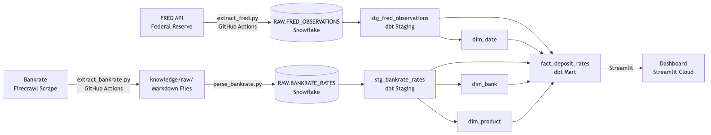
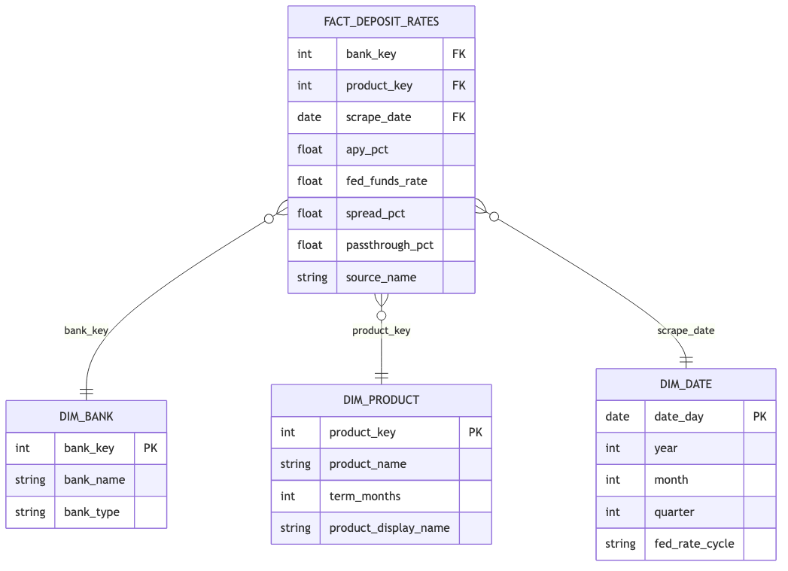

# Deposit Pricing Analytics

> Tracking how major U.S. banks respond to Federal Reserve rate changes and identifying where client deposits earn the most.

**Live Dashboard:** [deposit-pricing-analytics-banking.streamlit.app](https://deposit-pricing-analytics-banking.streamlit.app)

---

## Business Question

Where should a client deposit their money right now to get the most growth out of it?

This project tracks how major U.S. banks responded to Federal Reserve rate changes and builds the case for where client deposits should go. The Fed funds rate directly affects the APY banks offer on savings accounts. The APY is what determines how much a deposit grows over any given number of years. Bank choice is the only variable a client controls.

---

## Tech Stack

| Layer | Tool |
|-------|------|
| IDE | Cursor + Claude Code |
| Data Warehouse | Snowflake |
| Transformation | dbt |
| Orchestration | GitHub Actions (weekly schedule) |
| Dashboard | Streamlit (Community Cloud) |
| Knowledge Base | Claude Code + Firecrawl |
| Version Control | Git + GitHub |

---

## Data Sources

| Source | Type | Destination |
|--------|------|-------------|
| [FRED API](https://fred.stlouisfed.org/) | REST API | `DEPOSIT_ANALYTICS.RAW.FRED_OBSERVATIONS` |
| [Bankrate](https://www.bankrate.com/) | Firecrawl scrape | `knowledge/raw/` → `DEPOSIT_ANALYTICS.RAW.BANKRATE_RATES` |

FRED series loaded: Fed Funds Rate (monthly + daily), 3-Month/1-Year/2-Year/5-Year/10-Year Treasury yields, Discount Window Rate.

---

## Pipeline Diagram



---

## ERD



---

## Key Insights

- **Pass-through rate explains the APY gap:** The Fed funds rate sets the benchmark. Banks decide how much of it to share with depositors. Online banks like SoFi pass through 118% of the Fed rate, meaning their savings APY exceeds the Fed rate itself. JPMorgan Chase, Bank of America, and Wells Fargo pass through under 1%, keeping nearly the entire rate hike as profit margin.
- **Every online bank outperforms every traditional bank on savings APY:** SoFi leads at 4.30% APY. All online banks in this dataset fall between 3.80% and 4.30%. JPMorgan Chase, BofA, and Wells Fargo sit at 0.01%.
- **The dollar impact on $10,000 is immediate:** A $10,000 deposit at SoFi earns $430 per year. The same deposit at JPMorgan Chase earns $1 per year. Same deposit, same year, different bank.
- **Compounding widens the gap over time:** The difference between a 4.30% APY and a 0.01% APY compounds significantly. Over 10 years, the gap between the best and worst savings account on $10,000 grows to over $5,000.
- **Bank choice is the only variable a client controls:** The Fed rate moves on its own. The bank's pass-through policy is fixed. The only decision available to a client is which bank holds their deposit.

---

## Dashboard

**Live URL:** [deposit-pricing-analytics-banking.streamlit.app](https://deposit-pricing-analytics-banking.streamlit.app)

Four tabs, all focused on savings accounts:

1. **Descriptive: Which Bank Pays the Most?** — Ranked APY table with color gradient + bar chart. All banks, savings accounts only.
2. **Descriptive: How Much Will I Earn?** — Lollipop chart showing annual dollar earnings on a $10,000 deposit across all banks.
3. **Diagnostic: Why Do Some Banks Pay More?** — Pass-through rate chart with zone bands (Low / Medium / High) + ranked data table with annual earnings column.
4. **Where Should I Deposit My Money?** — Enter a deposit amount, get the top 5 savings accounts with projected growth over 1, 5, and 10 years.

---

## Pipeline Setup (Local)

```bash
# Clone and install
git clone https://github.com/DanielDistor/deposit-pricing-analytics-banking.git
cd deposit-pricing-analytics-banking
pip install -r requirements.txt

# Configure credentials (.env file)
# Required: SNOWFLAKE_ACCOUNT, SNOWFLAKE_USER, SNOWFLAKE_PASSWORD, FRED_API_KEY, FIRECRAWL_API_KEY

# Run extraction
python pipelines/extract_fred.py
python pipelines/extract_bankrate.py
python pipelines/parse_bankrate.py

# Run dbt
cd dbt
dbt run
dbt test
```

---

## Knowledge Base

Scraped sources and synthesized wiki pages are in `knowledge/`. Raw sources cover savings rate data from Bankrate, NerdWallet, and individual bank pages. Wiki pages synthesize trends across the Fed rate cycle, key entities, and bank behavior.

See [`knowledge/index.md`](knowledge/index.md) for all sources and wiki pages.

---

## Project Context

Built for LMU ISBA-4715 (Analytics Engineering), targeting the **JPMorgan Chase Wealth Management Deposit Pricing Analytics Associate** role. The project demonstrates SQL, dimensional modeling, data pipelines, and analytics skills directly required by the posting.
