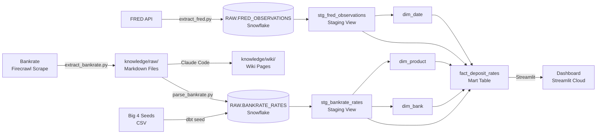
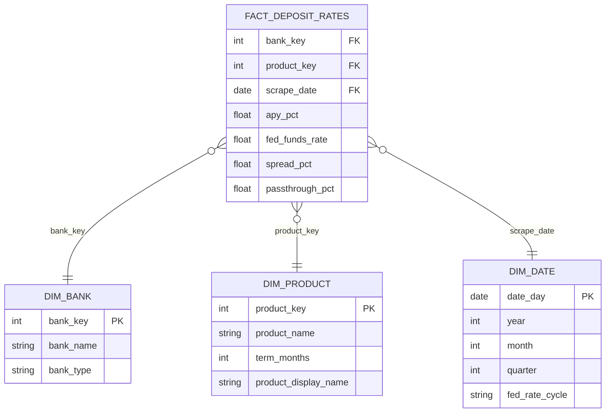

# Milestone 02: Transform, Present & Polish — Implementation Plan

> **For agentic workers:** REQUIRED SUB-SKILL: Use superpowers:subagent-driven-development (recommended) or superpowers:executing-plans to implement this plan task-by-task. Steps use checkbox (`- [ ]`) syntax for tracking.

**Goal:** Transform raw FRED + Bankrate data into a dbt star schema, Streamlit dashboard, automated pipelines, expanded knowledge base, and polished documentation — all deployed and ready for grading by May 4 at 9:55 AM.

**Architecture:** A new parser script extracts structured bank rates from Bankrate markdown and loads them to Snowflake RAW. dbt transforms RAW → STAGING → MART (star schema). Streamlit connects to MART for live charts and a bank recommender. GitHub Actions automates both extraction pipelines on a weekly schedule.

**Tech Stack:** Python 3.11, Snowflake, dbt-snowflake, Streamlit, Plotly, pandas, GitHub Actions

---

## File Map

```
pipelines/
  parse_bankrate.py          NEW — parse markdown → RAW.BANKRATE_RATES
  tests/
    test_parse_bankrate.py   NEW — unit tests for the parser

dbt/
  dbt_project.yml            NEW — dbt config
  profiles.yml               NEW — Snowflake connection (env vars, not committed)
  seeds/
    big_four_rates.csv       NEW — Chase, BofA, Wells Fargo, Citi rates
  models/
    staging/
      sources.yml            NEW — RAW source definitions
      stg_fred_observations.sql  NEW
      stg_bankrate_rates.sql     NEW
      schema.yml             NEW — staging tests
    mart/
      dim_bank.sql           NEW
      dim_product.sql        NEW
      dim_date.sql           NEW
      fact_deposit_rates.sql NEW
      schema.yml             NEW — mart tests

dashboard/
  app.py                     NEW — Streamlit app (4 tabs)
  requirements.txt           NEW — dashboard-specific deps
  .streamlit/
    secrets.toml             NEW — local dev only, never committed

.github/
  workflows/
    extract-fred.yml         NEW
    extract-bankrate.yml     NEW

knowledge/
  raw/                       EXPAND — scrape 13+ more sources
  wiki/
    overview.md              NEW
    key-entities.md          NEW
    fed-rate-cycle-analysis.md  NEW
  index.md                   NEW

README.md                    NEW — full project README
.gitignore                   MODIFY — add .streamlit/secrets.toml
```

---

## Task 1: Install dependencies + scaffold structure

**Files:**
- Modify: `requirements.txt`
- Create: `dashboard/requirements.txt`
- Create: `pipelines/tests/__init__.py`
- Modify: `.gitignore`

- [ ] **Step 1: Install dbt, streamlit, plotly, pandas**

```bash
pip install dbt-snowflake streamlit plotly pandas pytest
```

Expected: no errors, `dbt --version` prints a version number.

- [ ] **Step 2: Verify dbt-snowflake is available**

```bash
dbt --version
```

Expected output includes `dbt-snowflake` in the list.

- [ ] **Step 3: Update root requirements.txt**

Replace the contents of `requirements.txt`:

```
requests>=2.31.0
snowflake-connector-python>=3.6.0
firecrawl-py>=1.0.0
python-dotenv>=1.0.0
dbt-snowflake>=1.7.0
```

- [ ] **Step 4: Create dashboard/requirements.txt**

```
streamlit>=1.32.0
snowflake-connector-python>=3.6.0
pandas>=2.0.0
plotly>=5.18.0
```

- [ ] **Step 5: Create pipelines/tests/__init__.py**

```python
```
(empty file — marks directory as a Python package)

- [ ] **Step 6: Add secrets file to .gitignore**

Append to `.gitignore`:
```
.streamlit/secrets.toml
dbt/profiles.yml
```

- [ ] **Step 7: Create directory structure**

```bash
mkdir -p dashboard/.streamlit dbt/models/staging dbt/models/mart dbt/seeds pipelines/tests .github/workflows knowledge/wiki
```

- [ ] **Step 8: Commit**

```bash
git add requirements.txt dashboard/requirements.txt pipelines/tests/__init__.py .gitignore
git commit -m "chore: scaffold M2 directory structure and dependencies"
```

---

## Task 2: Write + test Bankrate markdown parser

**Files:**
- Create: `pipelines/tests/test_parse_bankrate.py`
- Create: `pipelines/parse_bankrate.py`

- [ ] **Step 1: Write the failing tests**

Create `pipelines/tests/test_parse_bankrate.py`:

```python
import pytest
from datetime import date
from pipelines.parse_bankrate import extract_rates_from_markdown, normalize_bank_name

SAMPLE_SAVINGS_MARKDOWN = """
## SoFi Checking and Savings
**APY:** 3.80% APY
Minimum balance: $0

## Ally High Yield Savings Account
Up to 4.00% APY
No minimum balance required

## Marcus by Goldman Sachs Online Savings Account
4.10% APY
"""

SAMPLE_CD_MARKDOWN = """
## Barclays Online CD
**APY:** 4.20% APY
Term: 1 year (12 months)

## Ally Bank CD
4.00% APY
12-month term
"""

SAMPLE_TABLE_MARKDOWN = """
| Bank | APY | Min. Balance |
|------|-----|-------------|
| SoFi Checking and Savings | 3.80% | $0 |
| Marcus by Goldman Sachs | 4.10% | $0 |
| Ally Bank | 4.00% | $0 |
"""


def test_extract_savings_from_sections():
    rows = extract_rates_from_markdown(SAMPLE_SAVINGS_MARKDOWN, "savings", date(2026, 4, 26))
    assert len(rows) >= 2
    apys = [r["apy_pct"] for r in rows]
    assert 3.80 in apys or any(abs(a - 3.80) < 0.01 for a in apys)


def test_extract_rates_from_table():
    rows = extract_rates_from_markdown(SAMPLE_TABLE_MARKDOWN, "savings", date(2026, 4, 26))
    assert len(rows) >= 2


def test_extract_cd_rates():
    rows = extract_rates_from_markdown(SAMPLE_CD_MARKDOWN, "cd", date(2026, 4, 26))
    assert len(rows) >= 1
    assert all(r["product_type"] == "cd" for r in rows)


def test_row_schema():
    rows = extract_rates_from_markdown(SAMPLE_SAVINGS_MARKDOWN, "savings", date(2026, 4, 26))
    for row in rows:
        assert "bank_name" in row
        assert "product_type" in row
        assert "apy_pct" in row
        assert "scrape_date" in row
        assert isinstance(row["apy_pct"], float)


def test_normalize_bank_name():
    assert normalize_bank_name("Marcus by Goldman Sachs Online Savings Account") == "Marcus by Goldman Sachs"
    assert normalize_bank_name("Ally High Yield Savings Account") == "Ally Bank"
    assert normalize_bank_name("SoFi Checking and Savings") == "SoFi"
```

- [ ] **Step 2: Run tests to confirm they fail**

```bash
cd /Users/danieldistor/Desktop/isba-4715-sql/deposit-pricing-analytics-banking
python -m pytest pipelines/tests/test_parse_bankrate.py -v
```

Expected: `ImportError` or `ModuleNotFoundError` — parse_bankrate.py doesn't exist yet.

- [ ] **Step 3: Implement parse_bankrate.py**

Create `pipelines/parse_bankrate.py`:

```python
import os
import re
from datetime import date
from pathlib import Path
from dotenv import load_dotenv
import snowflake.connector

load_dotenv()

RAW_DIR = Path(__file__).parent.parent / "knowledge" / "raw"

# Normalize long bank page titles to canonical names
BANK_NAME_MAP = {
    "sofi": "SoFi",
    "marcus by goldman sachs": "Marcus by Goldman Sachs",
    "marcus": "Marcus by Goldman Sachs",
    "ally": "Ally Bank",
    "discover": "Discover Bank",
    "american express": "American Express",
    "synchrony": "Synchrony Bank",
    "barclays": "Barclays",
    "capital one": "Capital One",
    "cit bank": "CIT Bank",
    "bread savings": "Bread Savings",
    "western alliance": "Western Alliance Bank",
    "everbank": "EverBank",
    "ufb direct": "UFB Direct",
    "varo": "Varo Bank",
    "lendingclub": "LendingClub Bank",
    "bask bank": "Bask Bank",
    "tab bank": "TAB Bank",
    "sallie mae": "Sallie Mae Bank",
    "cibc": "CIBC Bank USA",
    "my banking direct": "My Banking Direct",
    "nbkc": "NBKC Bank",
}

CD_TERM_MAP = {
    "3-month": 3, "3 month": 3, "3mo": 3,
    "6-month": 6, "6 month": 6, "6mo": 6,
    "1-year": 12, "1 year": 12, "12-month": 12, "12 month": 12,
    "2-year": 24, "2 year": 24, "24-month": 24,
    "3-year": 36, "3 year": 36, "36-month": 36,
    "5-year": 60, "5 year": 60, "60-month": 60,
}

APY_RE = re.compile(r'(\d+\.\d+)\s*%\s*(?:APY|apy)', re.IGNORECASE)
TABLE_ROW_RE = re.compile(r'\|\s*([^|]+?)\s*\|\s*(\d+\.\d+)\s*%', re.IGNORECASE)


def normalize_bank_name(raw: str) -> str:
    lower = raw.lower().strip()
    for key, canonical in BANK_NAME_MAP.items():
        if key in lower:
            return canonical
    # Return first 3 words as fallback
    words = raw.strip().split()
    return " ".join(words[:3]) if len(words) >= 3 else raw.strip()


def extract_term_months(text: str) -> int | None:
    lower = text.lower()
    for phrase, months in CD_TERM_MAP.items():
        if phrase in lower:
            return months
    return None


def extract_rates_from_markdown(markdown: str, product_type: str, scrape_date: date) -> list[dict]:
    rows = []
    seen_banks = set()

    # Strategy 1: parse markdown tables
    for line in markdown.splitlines():
        m = TABLE_ROW_RE.match(line.strip())
        if m:
            bank_raw, apy_str = m.group(1), m.group(2)
            bank = normalize_bank_name(bank_raw)
            if bank.lower() in ("bank", "institution", "bank name") or not bank:
                continue
            apy = float(apy_str)
            term = extract_term_months(line) if product_type == "cd" else None
            key = (bank, term)
            if key not in seen_banks:
                seen_banks.add(key)
                rows.append({
                    "bank_name": bank,
                    "product_type": product_type,
                    "term_months": term,
                    "apy_pct": apy,
                    "scrape_date": scrape_date,
                })

    if rows:
        return rows

    # Strategy 2: section-based parsing (## Bank Name ... APY%)
    sections = re.split(r'\n#{1,3}\s+', markdown)
    for section in sections:
        lines = section.strip().splitlines()
        if not lines:
            continue
        header = lines[0].strip()
        bank = normalize_bank_name(header)

        # Skip non-bank sections
        if any(skip in header.lower() for skip in ["table of contents", "overview", "methodology", "faq", "editorial"]):
            continue

        content = "\n".join(lines)
        apy_matches = APY_RE.findall(content)
        if not apy_matches:
            continue

        apy = float(apy_matches[0])
        term = extract_term_months(content) if product_type == "cd" else None
        key = (bank, term)
        if key not in seen_banks:
            seen_banks.add(key)
            rows.append({
                "bank_name": bank,
                "product_type": product_type,
                "term_months": term,
                "apy_pct": apy,
                "scrape_date": scrape_date,
            })

    return rows


def load_to_snowflake(rows: list[dict]) -> None:
    if not rows:
        print("No rows to load.")
        return

    conn = snowflake.connector.connect(
        account=os.getenv("SNOWFLAKE_ACCOUNT"),
        user=os.getenv("SNOWFLAKE_USER"),
        password=os.getenv("SNOWFLAKE_PASSWORD"),
        role="ACCOUNTADMIN",
    )
    cur = conn.cursor()
    try:
        cur.execute("USE WAREHOUSE COMPUTE_WH")
        cur.execute("USE DATABASE DEPOSIT_ANALYTICS")
        cur.execute("USE SCHEMA RAW")
        cur.execute("""
            CREATE TABLE IF NOT EXISTS BANKRATE_RATES (
                bank_name    VARCHAR(100),
                product_type VARCHAR(20),
                term_months  INTEGER,
                apy_pct      FLOAT,
                scrape_date  DATE,
                loaded_at    TIMESTAMP_NTZ DEFAULT CURRENT_TIMESTAMP()
            )
        """)
        cur.execute("TRUNCATE TABLE IF EXISTS BANKRATE_RATES")
        cur.executemany(
            """INSERT INTO BANKRATE_RATES (bank_name, product_type, term_months, apy_pct, scrape_date)
               VALUES (%s, %s, %s, %s, %s)""",
            [(r["bank_name"], r["product_type"], r["term_months"], r["apy_pct"], r["scrape_date"])
             for r in rows],
        )
        conn.commit()
        cur.execute("SELECT COUNT(*) FROM BANKRATE_RATES")
        count = cur.fetchone()[0]
        print(f"Loaded {count} rows to DEPOSIT_ANALYTICS.RAW.BANKRATE_RATES")
    finally:
        cur.close()
        conn.close()


def main():
    all_rows = []
    for md_file in sorted(RAW_DIR.glob("bankrate_savings_*.md")):
        print(f"Parsing {md_file.name}...")
        scrape_date = date.fromisoformat(md_file.stem.split("_")[-1])
        markdown = md_file.read_text(encoding="utf-8")
        rows = extract_rates_from_markdown(markdown, "savings", scrape_date)
        print(f"  Found {len(rows)} savings rates")
        all_rows.extend(rows)

    for md_file in sorted(RAW_DIR.glob("bankrate_cds_*.md")):
        print(f"Parsing {md_file.name}...")
        scrape_date = date.fromisoformat(md_file.stem.split("_")[-1])
        markdown = md_file.read_text(encoding="utf-8")
        rows = extract_rates_from_markdown(markdown, "cd", scrape_date)
        print(f"  Found {len(rows)} CD rates")
        all_rows.extend(rows)

    print(f"\nTotal: {len(all_rows)} rows across all files")
    load_to_snowflake(all_rows)


if __name__ == "__main__":
    main()
```

- [ ] **Step 4: Run tests — they should pass now**

```bash
python -m pytest pipelines/tests/test_parse_bankrate.py -v
```

Expected: all tests PASS.

- [ ] **Step 5: Commit**

```bash
git add pipelines/parse_bankrate.py pipelines/tests/test_parse_bankrate.py
git commit -m "feat: add Bankrate markdown parser with unit tests"
```

---

## Task 3: Run parser + verify Snowflake data

**Files:** (no new files — verify existing)

- [ ] **Step 1: Run the parser**

```bash
python pipelines/parse_bankrate.py
```

Expected output:
```
Parsing bankrate_savings_2026-04-26.md...
  Found X savings rates
Parsing bankrate_cds_2026-04-26.md...
  Found Y CD rates
Total: Z rows across all files
Loaded Z rows to DEPOSIT_ANALYTICS.RAW.BANKRATE_RATES
```

- [ ] **Step 2: Verify in Snowflake**

Run this SQL in Snowflake UI or via the connector:
```sql
SELECT product_type, COUNT(*) as n_banks, MIN(apy_pct) as min_apy, MAX(apy_pct) as max_apy
FROM DEPOSIT_ANALYTICS.RAW.BANKRATE_RATES
GROUP BY product_type
ORDER BY product_type;
```

Expected: at least 5 savings rows and 5 CD rows with reasonable APY values (0.5%–5.5%).

- [ ] **Step 3: If fewer than 5 rows per product type, inspect the markdown**

```bash
grep -i "% APY\|APY" knowledge/raw/bankrate_savings_2026-04-26.md | head -20
```

Examine the output and adjust the regex patterns in `parse_bankrate.py` to match the actual format, then re-run Step 1.

---

## Task 4: Set up dbt project skeleton

**Files:**
- Create: `dbt/dbt_project.yml`
- Create: `dbt/profiles.yml`
- Create: `dbt/models/staging/sources.yml`

- [ ] **Step 1: Initialize dbt project**

```bash
cd dbt
dbt init deposit_pricing --skip-profile-setup
cd ..
```

If `dbt init` creates extra files, delete them and use the config below instead.

- [ ] **Step 2: Create dbt/dbt_project.yml**

```yaml
name: 'deposit_pricing'
version: '1.0.0'
config-version: 2

profile: 'deposit_pricing'

model-paths: ["models"]
seed-paths: ["seeds"]
test-paths: ["tests"]

target-path: "target"
clean-targets: ["target", "dbt_packages"]

models:
  deposit_pricing:
    staging:
      +materialized: view
      +schema: staging
    mart:
      +materialized: table
      +schema: mart
```

- [ ] **Step 3: Create dbt/profiles.yml**

```yaml
deposit_pricing:
  target: dev
  outputs:
    dev:
      type: snowflake
      account: "{{ env_var('SNOWFLAKE_ACCOUNT') }}"
      user: "{{ env_var('SNOWFLAKE_USER') }}"
      password: "{{ env_var('SNOWFLAKE_PASSWORD') }}"
      role: ACCOUNTADMIN
      database: DEPOSIT_ANALYTICS
      warehouse: COMPUTE_WH
      schema: STAGING
      threads: 4
      client_session_keep_alive: false
```

- [ ] **Step 4: Create dbt/models/staging/sources.yml**

```yaml
version: 2

sources:
  - name: raw
    database: DEPOSIT_ANALYTICS
    schema: RAW
    tables:
      - name: fred_observations
        columns:
          - name: series_id
            tests: [not_null]
          - name: observation_date
            tests: [not_null]
          - name: value
            tests: [not_null]
      - name: bankrate_rates
        columns:
          - name: bank_name
            tests: [not_null]
          - name: apy_pct
            tests: [not_null]
```

- [ ] **Step 5: Verify dbt can connect**

```bash
cd dbt
dbt debug
cd ..
```

Expected: all checks pass (connection successful, warehouse accessible).

- [ ] **Step 6: Commit**

```bash
git add dbt/dbt_project.yml dbt/models/staging/sources.yml
git commit -m "feat: initialize dbt project with Snowflake connection"
```

Note: `dbt/profiles.yml` is in `.gitignore` — do NOT commit it.

---

## Task 5: Create dbt seeds (big four bank rates)

**Files:**
- Create: `dbt/seeds/big_four_rates.csv`

- [ ] **Step 1: Create the seed CSV**

Create `dbt/seeds/big_four_rates.csv`:

```csv
bank_name,product_type,term_months,apy_pct,scrape_date
JPMorgan Chase,savings,,0.01,2026-04-26
JPMorgan Chase,cd,12,4.00,2026-04-26
JPMorgan Chase,cd,6,3.75,2026-04-26
Bank of America,savings,,0.01,2026-04-26
Bank of America,cd,12,4.00,2026-04-26
Bank of America,cd,6,3.50,2026-04-26
Wells Fargo,savings,,0.01,2026-04-26
Wells Fargo,cd,12,4.01,2026-04-26
Wells Fargo,cd,6,3.51,2026-04-26
Citibank,savings,,0.04,2026-04-26
Citibank,cd,12,4.00,2026-04-26
Citibank,cd,6,3.75,2026-04-26
```

Note: These are approximate current rates for the big 4 as of April 2026. Verify against each bank's website before final submission and update if needed.

- [ ] **Step 2: Load the seed**

```bash
cd dbt
dbt seed
cd ..
```

Expected: `Completed successfully` with 12 rows loaded to `DEPOSIT_ANALYTICS.STAGING.BIG_FOUR_RATES`.

- [ ] **Step 3: Commit**

```bash
git add dbt/seeds/big_four_rates.csv
git commit -m "feat: add big four bank rates as dbt seed"
```

---

## Task 6: Write dbt staging models

**Files:**
- Create: `dbt/models/staging/stg_fred_observations.sql`
- Create: `dbt/models/staging/stg_bankrate_rates.sql`
- Create: `dbt/models/staging/schema.yml`

- [ ] **Step 1: Create stg_fred_observations.sql**

Create `dbt/models/staging/stg_fred_observations.sql`:

```sql
with source as (
    select * from {{ source('raw', 'fred_observations') }}
),

cleaned as (
    select
        series_id,
        observation_date                           as date_day,
        value                                      as rate_pct,
        case series_id
            when 'FEDFUNDS'  then 'Fed Funds Rate (Monthly Avg)'
            when 'DFF'       then 'Fed Funds Rate (Daily)'
            when 'TB3MS'     then '3-Month Treasury Bill'
            when 'GS1'       then '1-Year Treasury'
            when 'GS2'       then '2-Year Treasury'
            when 'GS5'       then '5-Year Treasury'
            when 'GS10'      then '10-Year Treasury'
            when 'DPCREDIT'  then 'Discount Window Rate'
            else series_id
        end                                        as series_name,
        loaded_at
    from source
    where value is not null
)

select * from cleaned
```

- [ ] **Step 2: Create stg_bankrate_rates.sql**

Create `dbt/models/staging/stg_bankrate_rates.sql`:

```sql
with bankrate as (
    select
        bank_name,
        product_type,
        term_months,
        apy_pct,
        scrape_date,
        'bankrate'  as source_name
    from {{ source('raw', 'bankrate_rates') }}
),

big_four as (
    select
        bank_name,
        product_type,
        term_months,
        apy_pct,
        cast(scrape_date as date) as scrape_date,
        'seed'      as source_name
    from {{ ref('big_four_rates') }}
),

combined as (
    select * from bankrate
    union all
    select * from big_four
),

cleaned as (
    select
        bank_name,
        lower(trim(product_type))                          as product_type,
        term_months,
        round(apy_pct, 4)                                  as apy_pct,
        scrape_date,
        source_name,
        case
            when bank_name in ('JPMorgan Chase', 'Bank of America', 'Wells Fargo', 'Citibank')
                then 'traditional'
            else 'online'
        end                                                as bank_type
    from combined
    where apy_pct > 0
      and apy_pct < 15  -- sanity filter
)

select * from cleaned
```

- [ ] **Step 3: Create schema.yml for staging**

Create `dbt/models/staging/schema.yml`:

```yaml
version: 2

models:
  - name: stg_fred_observations
    description: "Cleaned FRED time series data — Fed funds rate, Treasury yields, discount rate"
    columns:
      - name: series_id
        tests: [not_null]
      - name: date_day
        tests: [not_null]
      - name: rate_pct
        tests: [not_null]

  - name: stg_bankrate_rates
    description: "Combined bank deposit rates from Bankrate scrape + big four seeds"
    columns:
      - name: bank_name
        tests: [not_null]
      - name: product_type
        tests:
          - not_null
          - accepted_values:
              values: ['savings', 'cd']
      - name: apy_pct
        tests: [not_null]
      - name: bank_type
        tests:
          - not_null
          - accepted_values:
              values: ['online', 'traditional']
```

- [ ] **Step 4: Run and test staging models**

```bash
cd dbt
dbt run --select staging
dbt test --select staging
cd ..
```

Expected: all models created as views, all tests pass.

- [ ] **Step 5: Commit**

```bash
git add dbt/models/staging/
git commit -m "feat: add dbt staging models for FRED and Bankrate data"
```

---

## Task 7: Write dbt mart models

**Files:**
- Create: `dbt/models/mart/dim_bank.sql`
- Create: `dbt/models/mart/dim_product.sql`
- Create: `dbt/models/mart/dim_date.sql`
- Create: `dbt/models/mart/fact_deposit_rates.sql`
- Create: `dbt/models/mart/schema.yml`

- [ ] **Step 1: Create dim_bank.sql**

Create `dbt/models/mart/dim_bank.sql`:

```sql
with banks as (
    select distinct
        bank_name,
        bank_type
    from {{ ref('stg_bankrate_rates') }}
),

with_key as (
    select
        row_number() over (order by bank_name)  as bank_key,
        bank_name,
        bank_type
    from banks
)

select * from with_key
```

- [ ] **Step 2: Create dim_product.sql**

Create `dbt/models/mart/dim_product.sql`:

```sql
with products as (
    select distinct
        product_type,
        term_months
    from {{ ref('stg_bankrate_rates') }}
),

with_key as (
    select
        row_number() over (order by product_type, coalesce(term_months, 0)) as product_key,
        product_type                                                          as product_name,
        term_months,
        case
            when product_type = 'savings' then 'High-Yield Savings Account'
            when product_type = 'cd' and term_months = 3  then '3-Month CD'
            when product_type = 'cd' and term_months = 6  then '6-Month CD'
            when product_type = 'cd' and term_months = 12 then '1-Year CD'
            when product_type = 'cd' and term_months = 24 then '2-Year CD'
            when product_type = 'cd' and term_months = 36 then '3-Year CD'
            when product_type = 'cd' and term_months = 60 then '5-Year CD'
            else product_type
        end                                                                   as product_display_name
    from products
)

select * from with_key
```

- [ ] **Step 3: Create dim_date.sql**

Create `dbt/models/mart/dim_date.sql`:

```sql
with fred_dates as (
    select distinct date_day
    from {{ ref('stg_fred_observations') }}
    where series_id = 'FEDFUNDS'
),

with_attrs as (
    select
        date_day,
        year(date_day)    as year,
        month(date_day)   as month,
        quarter(date_day) as quarter,
        case
            when date_day between '2022-03-01' and '2023-07-31' then 'hiking'
            when date_day between '2024-09-01' and '2025-01-31' then 'cutting'
            else 'hold'
        end               as fed_rate_cycle
    from fred_dates
)

select * from with_attrs
```

- [ ] **Step 4: Create fact_deposit_rates.sql**

Create `dbt/models/mart/fact_deposit_rates.sql`:

```sql
with rates as (
    select * from {{ ref('stg_bankrate_rates') }}
),

banks as (
    select * from {{ ref('dim_bank') }}
),

products as (
    select * from {{ ref('dim_product') }}
),

-- Most recent FEDFUNDS rate for current spread calculation
latest_fed as (
    select rate_pct as fed_funds_rate
    from {{ ref('stg_fred_observations') }}
    where series_id = 'FEDFUNDS'
    order by date_day desc
    limit 1
),

-- Historical FEDFUNDS for rate cycle context
fred_history as (
    select
        date_day,
        rate_pct as fed_funds_rate
    from {{ ref('stg_fred_observations') }}
    where series_id = 'FEDFUNDS'
),

fact as (
    select
        b.bank_key,
        p.product_key,
        r.scrape_date,
        r.apy_pct,
        lf.fed_funds_rate,
        round(lf.fed_funds_rate - r.apy_pct, 4)                          as spread_pct,
        round(r.apy_pct / nullif(lf.fed_funds_rate, 0) * 100, 2)         as passthrough_pct,
        r.source_name
    from rates r
    left join banks b
        on b.bank_name = r.bank_name
    left join products p
        on p.product_name = r.product_type
       and coalesce(p.term_months, -1) = coalesce(r.term_months, -1)
    cross join latest_fed lf
)

select * from fact
```

- [ ] **Step 5: Create schema.yml for mart**

Create `dbt/models/mart/schema.yml`:

```yaml
version: 2

models:
  - name: dim_bank
    description: "Bank dimension — one row per bank with type classification"
    columns:
      - name: bank_key
        tests: [not_null, unique]
      - name: bank_name
        tests: [not_null, unique]
      - name: bank_type
        tests:
          - accepted_values:
              values: ['online', 'traditional']

  - name: dim_product
    description: "Product dimension — savings and CD products with display names"
    columns:
      - name: product_key
        tests: [not_null, unique]
      - name: product_name
        tests:
          - accepted_values:
              values: ['savings', 'cd']

  - name: dim_date
    description: "Date dimension with Fed rate cycle classification"
    columns:
      - name: date_day
        tests: [not_null, unique]

  - name: fact_deposit_rates
    description: "Fact table — one row per bank/product with current APY and spread vs. Fed rate"
    columns:
      - name: bank_key
        tests:
          - not_null
          - relationships:
              to: ref('dim_bank')
              field: bank_key
      - name: product_key
        tests:
          - not_null
          - relationships:
              to: ref('dim_product')
              field: product_key
      - name: apy_pct
        tests: [not_null]
      - name: passthrough_pct
        tests: [not_null]
```

- [ ] **Step 6: Run mart models + tests**

```bash
cd dbt
dbt run --select mart
dbt test --select mart
cd ..
```

Expected: 4 mart tables created, all relationship and not_null tests pass.

- [ ] **Step 7: Spot-check the fact table**

Run in Snowflake UI:
```sql
SELECT b.bank_name, b.bank_type, p.product_display_name, f.apy_pct, f.fed_funds_rate, f.passthrough_pct
FROM DEPOSIT_ANALYTICS.MART.FACT_DEPOSIT_RATES f
JOIN DEPOSIT_ANALYTICS.MART.DIM_BANK b ON b.bank_key = f.bank_key
JOIN DEPOSIT_ANALYTICS.MART.DIM_PRODUCT p ON p.product_key = f.product_key
ORDER BY f.apy_pct DESC
LIMIT 20;
```

Expected: online banks at the top (3–5% APY), big 4 at the bottom (0.01–4%).

- [ ] **Step 8: Commit**

```bash
git add dbt/models/mart/
git commit -m "feat: add dbt mart star schema (dim_bank, dim_product, dim_date, fact_deposit_rates)"
```

---

## Task 8: Build Streamlit dashboard

**Files:**
- Create: `dashboard/app.py`
- Create: `dashboard/.streamlit/secrets.toml` (local only, never committed)

- [ ] **Step 1: Create local Streamlit secrets file**

Create `dashboard/.streamlit/secrets.toml` (this file is already in .gitignore):

```toml
[snowflake]
account = "your_snowflake_account"
user = "your_snowflake_user"
password = "your_snowflake_password"
warehouse = "COMPUTE_WH"
database = "DEPOSIT_ANALYTICS"
schema = "MART"
```

Replace values with your actual credentials from `.env`.

- [ ] **Step 2: Create dashboard/app.py**

Create `dashboard/app.py`:

```python
import streamlit as st
import snowflake.connector
import pandas as pd
import plotly.express as px
import plotly.graph_objects as go

st.set_page_config(
    page_title="Deposit Pricing Analytics",
    page_icon="🏦",
    layout="wide",
)

@st.cache_resource
def get_connection():
    return snowflake.connector.connect(
        account=st.secrets["snowflake"]["account"],
        user=st.secrets["snowflake"]["user"],
        password=st.secrets["snowflake"]["password"],
        warehouse=st.secrets["snowflake"]["warehouse"],
        database=st.secrets["snowflake"]["database"],
        schema=st.secrets["snowflake"]["schema"],
    )


@st.cache_data(ttl=3600)
def run_query(sql: str) -> pd.DataFrame:
    conn = get_connection()
    cur = conn.cursor()
    cur.execute(sql)
    cols = [desc[0].lower() for desc in cur.description]
    return pd.DataFrame(cur.fetchall(), columns=cols)


def load_fact_data() -> pd.DataFrame:
    return run_query("""
        SELECT
            b.bank_name,
            b.bank_type,
            p.product_display_name,
            p.product_name,
            p.term_months,
            f.apy_pct,
            f.fed_funds_rate,
            f.spread_pct,
            f.passthrough_pct,
            f.scrape_date
        FROM fact_deposit_rates f
        JOIN dim_bank b    ON b.bank_key    = f.bank_key
        JOIN dim_product p ON p.product_key = f.product_key
        ORDER BY f.apy_pct DESC
    """)


def load_fred_history() -> pd.DataFrame:
    return run_query("""
        SELECT date_day, rate_pct, series_name
        FROM DEPOSIT_ANALYTICS.STAGING.STG_FRED_OBSERVATIONS
        WHERE series_id = 'FEDFUNDS'
        ORDER BY date_day
    """)


# ── Header ────────────────────────────────────────────────────────────────────
st.title("🏦 Deposit Pricing Analytics")
st.caption(
    "Tracking how major U.S. banks respond to Federal Reserve rate changes. "
    "Data: FRED API (Fed rates) + Bankrate (bank deposit rates)."
)

df = load_fact_data()
fred = load_fred_history()
current_fed_rate = df["fed_funds_rate"].iloc[0] if not df.empty else 0.0

st.metric("Current Fed Funds Rate", f"{current_fed_rate:.2f}%")
st.divider()

# ── Tabs ──────────────────────────────────────────────────────────────────────
tab1, tab2, tab3, tab4 = st.tabs([
    "📊 Current Rates",
    "📈 Rate Timeline",
    "⚡ Pass-Through Analysis",
    "💡 Bank Recommender",
])


# ── Tab 1: Current Rates ──────────────────────────────────────────────────────
with tab1:
    st.subheader("Current Deposit Rates — All Banks")
    st.caption(
        "A snapshot of today's deposit rates across all banks, ranked by APY. "
        "Green = higher pass-through, Red = bank keeping more of the Fed rate as margin."
    )

    product_filter = st.selectbox(
        "Filter by product",
        options=["All", "savings", "cd"],
        format_func=lambda x: "All Products" if x == "All" else ("Savings Accounts" if x == "savings" else "CDs"),
        key="tab1_product",
    )

    display_df = df.copy()
    if product_filter != "All":
        display_df = display_df[display_df["product_name"] == product_filter]

    display_df = display_df[[
        "bank_name", "bank_type", "product_display_name",
        "apy_pct", "fed_funds_rate", "spread_pct", "passthrough_pct"
    ]].rename(columns={
        "bank_name": "Bank",
        "bank_type": "Type",
        "product_display_name": "Product",
        "apy_pct": "APY (%)",
        "fed_funds_rate": "Fed Rate (%)",
        "spread_pct": "Spread (%)",
        "passthrough_pct": "Pass-Through (%)",
    })

    st.dataframe(
        display_df.style.background_gradient(subset=["APY (%)"], cmap="RdYlGn"),
        use_container_width=True,
        hide_index=True,
    )


# ── Tab 2: Rate Timeline ──────────────────────────────────────────────────────
with tab2:
    st.subheader("Rate Timeline: Banks vs. the Fed")
    st.caption(
        "How have deposit rates changed over time relative to the Federal Reserve's benchmark rate? "
        "Banks that closely track the Fed line are passing more value to savers."
    )

    bank_options = sorted(df["bank_name"].unique().tolist())
    selected_banks = st.multiselect(
        "Select banks to display",
        options=bank_options,
        default=bank_options[:6],
        key="tab2_banks",
    )

    product_tab2 = st.radio(
        "Product type",
        options=["savings", "cd"],
        format_func=lambda x: "Savings Accounts" if x == "savings" else "CDs",
        horizontal=True,
        key="tab2_product",
    )

    fig = go.Figure()

    # Fed funds rate line
    fig.add_trace(go.Scatter(
        x=fred["date_day"],
        y=fred["rate_pct"],
        name="Fed Funds Rate",
        line=dict(color="black", width=3, dash="dash"),
    ))

    # Current bank rates as horizontal reference lines
    bank_slice = df[
        (df["bank_name"].isin(selected_banks)) &
        (df["product_name"] == product_tab2)
    ]
    colors = px.colors.qualitative.Set2
    for i, (_, row) in enumerate(bank_slice.iterrows()):
        fig.add_hline(
            y=row["apy_pct"],
            line_color=colors[i % len(colors)],
            line_width=2,
            annotation_text=f"{row['bank_name']} ({row['apy_pct']:.2f}%)",
            annotation_position="right",
        )

    fig.update_layout(
        xaxis_title="Date",
        yaxis_title="Rate (%)",
        legend_title="Series",
        height=500,
    )
    st.plotly_chart(fig, use_container_width=True)
    st.info(
        "**Takeaway:** The Fed raised rates from ~0% to 5.25%+ during 2022–2023. "
        "Online banks tracked this rise; big traditional banks barely moved their savings rates."
    )


# ── Tab 3: Pass-Through Analysis ─────────────────────────────────────────────
with tab3:
    st.subheader("Pass-Through Analysis: Who Shared Fed Hikes with Savers?")
    st.caption(
        "Pass-through % = bank's current APY ÷ current Fed funds rate × 100. "
        "A bank at 100% gives savers the full Fed rate. Lower = bank kept more as margin."
    )

    product_tab3 = st.radio(
        "Product type",
        options=["savings", "cd"],
        format_func=lambda x: "Savings Accounts" if x == "savings" else "CDs",
        horizontal=True,
        key="tab3_product",
    )

    pt_df = df[df["product_name"] == product_tab3].sort_values("passthrough_pct", ascending=True)

    fig2 = px.bar(
        pt_df,
        x="passthrough_pct",
        y="bank_name",
        orientation="h",
        color="bank_type",
        color_discrete_map={"online": "#2ecc71", "traditional": "#e74c3c"},
        labels={
            "passthrough_pct": "Pass-Through (%)",
            "bank_name": "Bank",
            "bank_type": "Type",
        },
        title=f"Pass-Through Rate by Bank — {'Savings' if product_tab3 == 'savings' else 'CD'}",
    )
    fig2.update_layout(height=max(400, len(pt_df) * 30))
    st.plotly_chart(fig2, use_container_width=True)
    st.info(
        "**Takeaway:** Online banks consistently pass through 70–90%+ of Fed rate increases. "
        "Traditional big banks pass through under 5% on savings accounts, keeping the spread as profit."
    )


# ── Tab 4: Bank Recommender ───────────────────────────────────────────────────
with tab4:
    st.subheader("💡 Bank Recommender")
    st.caption(
        "Based on current rates and historical fairness, which bank should your client choose? "
        "Enter the deposit amount and product preference to see projected annual earnings."
    )

    col1, col2 = st.columns(2)
    with col1:
        deposit_amount = st.slider(
            "Deposit amount ($)",
            min_value=1_000,
            max_value=1_000_000,
            value=50_000,
            step=1_000,
            format="$%d",
        )
    with col2:
        product_rec = st.radio(
            "Product type",
            options=["savings", "cd"],
            format_func=lambda x: "Savings Account" if x == "savings" else "Certificate of Deposit (CD)",
            key="tab4_product",
        )

    term_months = None
    if product_rec == "cd":
        term_label = st.selectbox(
            "CD term",
            options=["6-Month CD", "1-Year CD", "3-Year CD", "5-Year CD"],
        )
        term_map = {"6-Month CD": 6, "1-Year CD": 12, "3-Year CD": 36, "5-Year CD": 60}
        term_months = term_map[term_label]

    rec_df = df[df["product_name"] == product_rec].copy()
    if term_months:
        rec_df = rec_df[rec_df["term_months"] == term_months]

    rec_df["annual_earnings"] = (rec_df["apy_pct"] / 100 * deposit_amount).round(2)
    rec_df = rec_df.sort_values("apy_pct", ascending=False).head(5)
    rec_df["rationale"] = rec_df.apply(
        lambda r: (
            f"Top-rated online bank with {r['passthrough_pct']:.0f}% Fed rate pass-through."
            if r["bank_type"] == "online"
            else f"Traditional bank — {r['passthrough_pct']:.0f}% pass-through, stable and FDIC insured."
        ),
        axis=1,
    )

    st.subheader(f"Top Banks for ${deposit_amount:,.0f} Deposit")
    for i, row in rec_df.iterrows():
        with st.container():
            medal = ["🥇", "🥈", "🥉", "4️⃣", "5️⃣"][list(rec_df.index).index(i)]
            st.markdown(f"### {medal} {row['bank_name']}")
            c1, c2, c3 = st.columns(3)
            c1.metric("APY", f"{row['apy_pct']:.2f}%")
            c2.metric("Annual Earnings", f"${row['annual_earnings']:,.2f}")
            c3.metric("Pass-Through", f"{row['passthrough_pct']:.0f}%")
            st.caption(row["rationale"])
            st.divider()
```

- [ ] **Step 3: Run locally to verify**

```bash
cd dashboard
streamlit run app.py
```

Open `http://localhost:8501` in your browser. Verify:
- All 4 tabs load without errors
- Current Rates table shows data
- Rate Timeline shows the Fed funds rate line
- Pass-Through bar chart renders
- Bank Recommender updates when you change the deposit slider

- [ ] **Step 4: Fix any errors, then commit**

```bash
git add dashboard/app.py dashboard/requirements.txt
git commit -m "feat: add Streamlit dashboard with 4 tabs (rates, timeline, pass-through, recommender)"
```

---

## Task 9: Deploy dashboard to Streamlit Community Cloud

**Files:** (no new code — deployment config)

- [ ] **Step 1: Push latest commits to GitHub**

```bash
git push origin main
```

- [ ] **Step 2: Deploy on Streamlit Community Cloud**

1. Go to [share.streamlit.io](https://share.streamlit.io) and log in
2. Click **"Create app"**
3. Set:
   - Repository: `DanielDistor/deposit-pricing-analytics-banking`
   - Branch: `main`
   - Main file path: `dashboard/app.py`
4. Click **"Advanced settings"** → **"Secrets"**
5. Paste your Snowflake credentials in TOML format:
   ```toml
   [snowflake]
   account = "your_account"
   user = "your_user"
   password = "your_password"
   warehouse = "COMPUTE_WH"
   database = "DEPOSIT_ANALYTICS"
   schema = "MART"
   ```
6. Click **"Deploy"** — wait 2–3 minutes for the build

- [ ] **Step 3: Verify public URL works**

Open the public URL (e.g. `danieldistor-deposit-pricing.streamlit.app`) in an incognito window. Confirm all 4 tabs load with live data.

- [ ] **Step 4: Save the URL**

Copy the public URL — you'll add it to the README in Task 12.

---

## Task 10: Expand knowledge base (run in parallel with Tasks 1–9 if possible)

**Files:**
- Create: 13+ new files in `knowledge/raw/`
- Create: `knowledge/wiki/overview.md`
- Create: `knowledge/wiki/key-entities.md`
- Create: `knowledge/wiki/fed-rate-cycle-analysis.md`
- Create: `knowledge/index.md`

- [ ] **Step 1: Scrape additional sources using Firecrawl MCP**

In Claude Code, use the Firecrawl MCP to scrape these URLs and save each to `knowledge/raw/` with a descriptive filename (`source_topic_YYYY-MM-DD.md`):

**Bankrate articles (3 files):**
- `https://www.bankrate.com/banking/savings/fed-rate-hikes-and-savings-account-rates/`
- `https://www.bankrate.com/banking/savings/high-yield-savings-account-rates-history/`
- `https://www.bankrate.com/banking/cds/cd-rates-history/`

**NerdWallet (3 files):**
- `https://www.nerdwallet.com/best/banking/high-yield-online-savings-accounts`
- `https://www.nerdwallet.com/best/banking/cd-rates`
- `https://www.nerdwallet.com/article/banking/federal-reserve-interest-rates-affect-savings`

**Federal Reserve (3 files):**
- `https://www.federalreserve.gov/monetarypolicy/openmarket.htm`
- `https://www.federalreserve.gov/releases/h15/`
- A recent FOMC press release from federalreserve.gov

**Individual bank pages (4 files):**
- Chase savings: `https://www.chase.com/personal/savings/compare-savings-accounts`
- Ally: `https://www.ally.com/bank/online-savings-account/`
- Marcus: `https://www.marcus.com/us/en/savings/high-yield-savings`
- SoFi: `https://www.sofi.com/banking/savings/`

- [ ] **Step 2: Verify file count**

```bash
ls knowledge/raw/ | grep -v ".gitkeep" | wc -l
```

Expected: 15 or more files.

- [ ] **Step 3: Generate wiki pages using Claude Code**

Ask Claude Code (in a new message): *"Read all files in knowledge/raw/ and generate three wiki pages: overview.md (what deposit pricing is, how the Fed rate cycle works, why spreads matter), key-entities.md (bank profiles, product types, rate terminology), and fed-rate-cycle-analysis.md (synthesis of the 2022–2023 hiking cycle — who won, who lost, pass-through analysis). Each wiki page should synthesize across multiple sources, not just summarize individual files."*

Save to:
- `knowledge/wiki/overview.md`
- `knowledge/wiki/key-entities.md`
- `knowledge/wiki/fed-rate-cycle-analysis.md`

- [ ] **Step 4: Create knowledge/index.md**

```markdown
# Knowledge Base Index

## Wiki Pages

| Page | Description |
|------|-------------|
| [Overview](wiki/overview.md) | What deposit pricing is, how the Fed rate cycle works, and why bank spreads matter for savers |
| [Key Entities](wiki/key-entities.md) | Bank profiles, product type definitions, and rate terminology glossary |
| [Fed Rate Cycle Analysis](wiki/fed-rate-cycle-analysis.md) | Synthesis of the 2022–2023 hiking cycle: who passed through the most, who kept the spread |

## Raw Sources

| File | Source | Topic |
|------|--------|-------|
| bankrate_savings_2026-04-26.md | Bankrate | Best high-yield savings accounts |
| bankrate_cds_2026-04-26.md | Bankrate | Best CD rates |
[... list remaining files ...]

## How to Query

Ask Claude Code questions like:
- "What does the knowledge base say about how online banks responded to Fed rate hikes?"
- "Which banks are described as having the highest pass-through in my sources?"
- "Summarize what the knowledge base says about the 2022–2023 rate hiking cycle"

Claude Code will read the wiki pages and raw sources to answer.
```

- [ ] **Step 5: Commit**

```bash
git add knowledge/
git commit -m "feat: expand knowledge base to 15+ sources, add wiki pages and index"
```

---

## Task 11: Set up GitHub Actions workflows

**Files:**
- Create: `.github/workflows/extract-fred.yml`
- Create: `.github/workflows/extract-bankrate.yml`

- [ ] **Step 1: Create extract-fred.yml**

Create `.github/workflows/extract-fred.yml`:

```yaml
name: Extract FRED Data

on:
  schedule:
    - cron: '0 6 * * 0'  # Every Sunday at 6 AM UTC
  workflow_dispatch:

jobs:
  extract:
    runs-on: ubuntu-latest

    steps:
      - name: Checkout repo
        uses: actions/checkout@v4

      - name: Set up Python
        uses: actions/setup-python@v5
        with:
          python-version: '3.11'

      - name: Install dependencies
        run: pip install -r requirements.txt

      - name: Run FRED extraction
        run: python pipelines/extract_fred.py
        env:
          SNOWFLAKE_ACCOUNT: ${{ secrets.SNOWFLAKE_ACCOUNT }}
          SNOWFLAKE_USER: ${{ secrets.SNOWFLAKE_USER }}
          SNOWFLAKE_PASSWORD: ${{ secrets.SNOWFLAKE_PASSWORD }}
          FRED_API_KEY: ${{ secrets.FRED_API_KEY }}
```

- [ ] **Step 2: Create extract-bankrate.yml**

Create `.github/workflows/extract-bankrate.yml`:

```yaml
name: Extract Bankrate Data

on:
  schedule:
    - cron: '0 7 * * 0'  # Every Sunday at 7 AM UTC (after FRED)
  workflow_dispatch:

jobs:
  extract:
    runs-on: ubuntu-latest

    steps:
      - name: Checkout repo
        uses: actions/checkout@v4

      - name: Set up Python
        uses: actions/setup-python@v5
        with:
          python-version: '3.11'

      - name: Install dependencies
        run: pip install -r requirements.txt

      - name: Scrape Bankrate pages
        run: python pipelines/extract_bankrate.py
        env:
          FIRECRAWL_API_KEY: ${{ secrets.FIRECRAWL_API_KEY }}

      - name: Parse and load to Snowflake
        run: python pipelines/parse_bankrate.py
        env:
          SNOWFLAKE_ACCOUNT: ${{ secrets.SNOWFLAKE_ACCOUNT }}
          SNOWFLAKE_USER: ${{ secrets.SNOWFLAKE_USER }}
          SNOWFLAKE_PASSWORD: ${{ secrets.SNOWFLAKE_PASSWORD }}
```

- [ ] **Step 3: Add GitHub Secrets**

In GitHub → repo → Settings → Secrets and variables → Actions → New repository secret:
- `SNOWFLAKE_ACCOUNT` — value from your `.env`
- `SNOWFLAKE_USER` — value from your `.env`
- `SNOWFLAKE_PASSWORD` — value from your `.env`
- `FRED_API_KEY` — value from your `.env`
- `FIRECRAWL_API_KEY` — value from your `.env`

- [ ] **Step 4: Test with manual trigger**

In GitHub → Actions → "Extract FRED Data" → "Run workflow" → "Run workflow".

Wait ~2 minutes. Verify the workflow run shows green.

- [ ] **Step 5: Commit**

```bash
git add .github/
git commit -m "feat: add GitHub Actions workflows for FRED and Bankrate extraction"
```

---

## Task 12: Write README + ERD + pipeline diagram

**Files:**
- Create/Overwrite: `README.md`

- [ ] **Step 1: Write README.md**

Create `README.md` (replace STREAMLIT_URL with your actual public URL):

```markdown
# Deposit Pricing Analytics

Tracking how major U.S. banks respond to Federal Reserve rate changes — and which banks pass the most value to savers.

**Live Dashboard:** [STREAMLIT_URL]

---

## Business Question

When the Fed raises or lowers interest rates, how do major banks respond with their deposit pricing? Which banks pass through rate changes fastest, and who is winning deposits?

## Tech Stack

| Layer | Tool |
|-------|------|
| Data Warehouse | Snowflake |
| Transformation | dbt |
| Orchestration | GitHub Actions |
| Dashboard | Streamlit (Community Cloud) |
| Knowledge Base | Claude Code + Firecrawl |

## Data Sources

- **FRED API** — Federal Reserve rate data (Fed funds rate, Treasury yields), loaded weekly to `DEPOSIT_ANALYTICS.RAW.FRED_OBSERVATIONS`
- **Bankrate** (Firecrawl scrape) — Bank deposit rates (savings + CDs), loaded weekly to `DEPOSIT_ANALYTICS.RAW.BANKRATE_RATES`

## Pipeline Setup

```bash
# Clone and install
git clone https://github.com/DanielDistor/deposit-pricing-analytics-banking.git
cd deposit-pricing-analytics-banking
pip install -r requirements.txt

# Configure credentials
cp .env.example .env  # fill in Snowflake, FRED, Firecrawl keys

# Run extraction
python pipelines/extract_fred.py
python pipelines/extract_bankrate.py
python pipelines/parse_bankrate.py

# Run dbt
cd dbt && dbt run && dbt test
```

## Pipeline Diagram



## ERD



## Key Insights

- **Online banks tracked the Fed:** During the 2022–2023 rate hiking cycle (Fed: 0% → 5.25%), online banks like Marcus by Goldman Sachs and Ally raised savings APYs by 4–5%, closely matching the Fed.
- **Big banks kept the spread:** JPMorgan Chase, Bank of America, and Wells Fargo savings accounts remained near 0.01% APY throughout — capturing 5%+ of margin on every deposited dollar.
- **Client recommendation:** A $100,000 deposit in a top online savings account earns ~$4,000–$5,000 more per year than the same deposit at a big bank.

## Knowledge Base

Scraped sources and synthesized wiki pages are in `knowledge/`. To query:

```
Ask Claude Code: "What does the knowledge base say about how Chase responded to Fed rate hikes?"
```

See `knowledge/index.md` for all sources and wiki pages.
```

- [ ] **Step 2: Commit**

```bash
git add README.md
git commit -m "docs: add full README with pipeline diagram, ERD, and insights"
```

---

## Task 13: Repo cleanup + final commit

**Files:**
- Modify: `.gitignore` (verify)

- [ ] **Step 1: Remove any .DS_Store files from git**

```bash
find . -name ".DS_Store" -not -path "./.git/*" -exec git rm --cached {} \;
echo ".DS_Store" >> .gitignore
```

- [ ] **Step 2: Verify no credentials are tracked**

```bash
git ls-files | grep -E "\.env|secrets|password|credentials"
```

Expected: no output. If any files appear, add them to `.gitignore` and remove with `git rm --cached`.

- [ ] **Step 3: Check all M2 deliverables are present**

```bash
# dbt models
ls dbt/models/staging/ dbt/models/mart/ dbt/seeds/

# Dashboard
ls dashboard/app.py

# Pipelines
ls pipelines/parse_bankrate.py pipelines/extract_fred.py pipelines/extract_bankrate.py

# GitHub Actions
ls .github/workflows/

# Knowledge base
echo "Raw sources:" && ls knowledge/raw/ | grep -v .gitkeep | wc -l
echo "Wiki pages:" && ls knowledge/wiki/

# Docs
ls README.md docs/slides.pdf
```

- [ ] **Step 4: Final commit**

```bash
git add -A
git status  # review — make sure no .env or secrets files appear
git commit -m "chore: repo cleanup and final M2 polish"
git push origin main
```

- [ ] **Step 5: Submit repo URL to Brightspace**

URL: `https://github.com/DanielDistor/deposit-pricing-analytics-banking`

---

## Deliverable Checklist

| # | Deliverable | Task(s) | Done? |
|---|-------------|---------|-------|
| 6 | dbt project (star schema, tests pass) | 4–7 | ☐ |
| 7 | Streamlit dashboard (deployed, public URL) | 8–9 | ☐ |
| 8 | GitHub Actions pipelines (both workflows) | 11 | ☐ |
| 9 | Pipeline diagram in README (Mermaid) | 12 | ☐ |
| 10 | Presentation slides PDF | (after dashboard: screenshot charts → Google Slides → export PDF → docs/slides.pdf) | ☐ |
| 11 | 15+ knowledge base sources + 3 wiki pages | 10 | ☐ |
| 12 | README.md with all required sections | 12 | ☐ |
| 13 | ERD in README (Mermaid) | 12 | ☐ |
| 14 | Clean repo, meaningful commits | 13 | ☐ |
